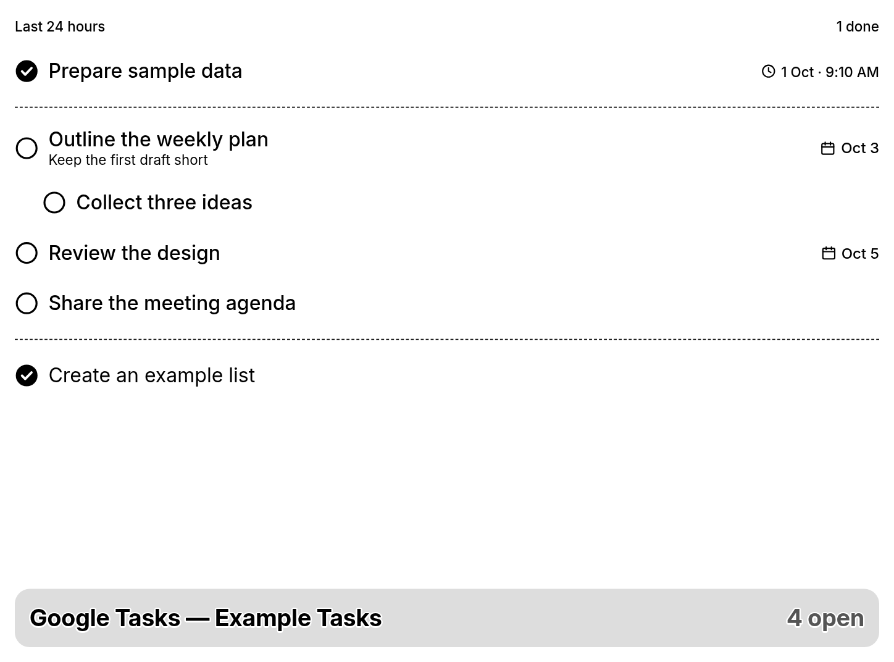

# LaraPaper task plugins

Two self-hosted task feeds and screen recipes for [LaraPaper](https://github.com/usetrmnl/larapaper):

| Plugin                                                 | Source             | What it shows                                            |
| ------------------------------------------------------ | ------------------ | -------------------------------------------------------- |
| [Google Tasks](google-tasks/README.md)                 | Google Tasks API   | A task list, subtasks, and recent completions            |
| [GitHub Project Tasks](github-project-tasks/README.md) | GitHub Projects v2 | Items assigned to one user, including recent completions |

Each plugin has a small feed service and an importable LaraPaper recipe in its
`recipe/` directory. You can use either plugin independently. Follow its
README for credentials, deployment, and recipe installation.

## Example screens

These are rendered from the recipes with invented tasks.

### GitHub Project Tasks

### Google Tasks

The example Compose files attach feeds to the existing LaraPaper Docker
network. Only Google Tasks' OAuth page is bound to localhost. Keep feed
endpoints private: their responses can contain personal task data. Never
commit `.env`, `config.env`, token stores, generated snapshots, or previews.

The recipe images use [GitHub Octicons](github-project-tasks/OCTICONS-LICENSE)
for issue status icons.

Licensed under [MIT](LICENSE). Octicons retain their own license.
