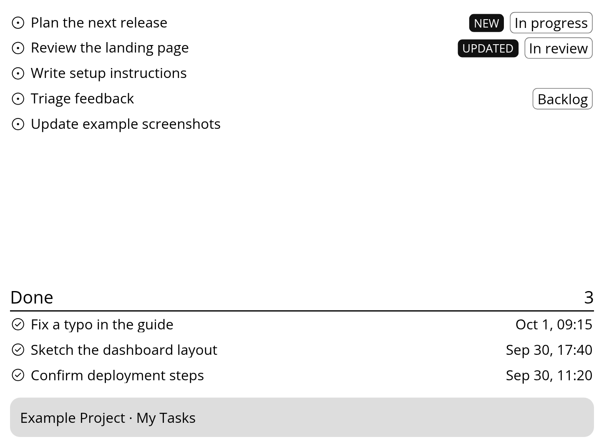

# GitHub Project Tasks for LaraPaper

A read-only feed for one GitHub Projects v2 board and a LaraPaper recipe.
The screen shows items assigned to one account, with `NEW` or `UPDATED`
indicators for two hours after a change. Items moved to Done during the past
24 hours appear below active work. The first fetch establishes a baseline.

The connector reads item titles, assignees, and Project Status. For completed
items, the displayed time is when the Project Status field was last changed.
The screen fits ten items and prioritizes marked active items.

## Set up GitHub

1. Create a fine-grained personal access token with access to the Project's
   organization, **Projects: read-only**, and **Issues: read-only** on the
   repositories represented in the board. Authorize the token for your
   organization if required.
2. Copy `.env.example` to `.env`, put the token after `GITHUB_TOKEN=`, and
   run `chmod 600 .env`. Keep this file out of Git.
3. Copy `config.example.env` to `config.env` and set the organization, Project
   number, assignee login, and display time zone.
4. Make sure the LaraPaper Docker network exists. The example uses
   `larapaper_default`; set `LARAPAPER_NETWORK` when yours differs.
5. Run `docker compose -f compose.example.yml up -d --build`.

The feed runs at `http://github-project:8080/tasks` within the LaraPaper
network. `/health` reports connector health. Its token is mounted read-only;
the Docker volume saves change indicators across container restarts. The
connector caches responses for one minute.

## Install the recipe

Run `./scripts/package-recipe.sh` and import the ZIP from `dist/` into
LaraPaper. Set **Connector feed URL** to
`http://github-project:8080/tasks`.

LaraPaper polls the feed every five minutes. The e-reader's own screen
refresh interval is configured separately in LaraPaper. `recipe/settings.yml`
and `recipe/full.liquid` can be customized before packaging.

The issue icons are from GitHub Octicons; see `OCTICONS-LICENSE`.
